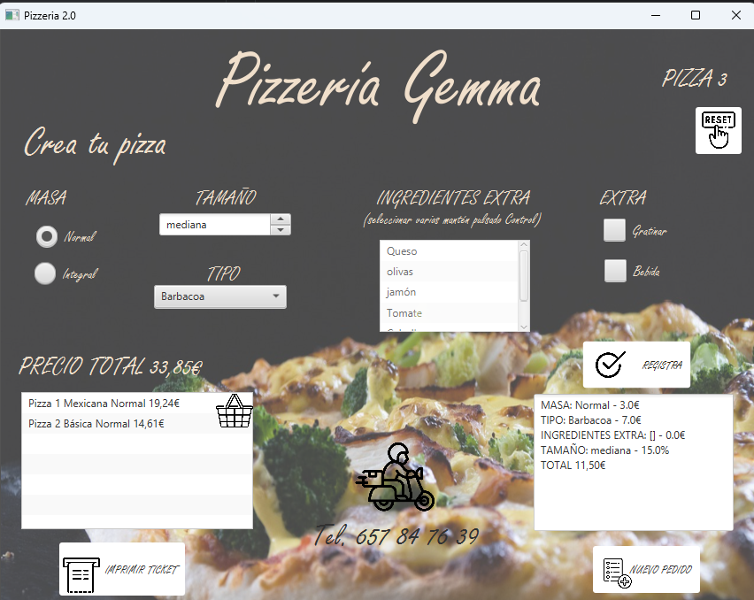
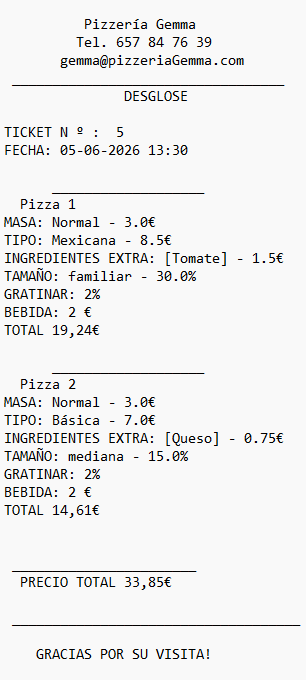

Markdown

# PizzeriaJavaFx
pAplicación de escritorio desarrollada con JavaFX para la gestión y realización de pedidos en una pizzería.

## Descripción del Proyecto
Este proyecto permite al usuario configurar las pizzas paso a paso y gestionar la comanda. 
- Se seleccionan el tipo, tamaño, ingredientes y varios extras.
- Calcula automáticamente el precio según las opciones seleccionadas.
- Genera el tiquet en .txt con los conceptos y el total.

## Capturas de Pantalla

### Interfaz Principal
Interfaz donde el usuario crea la pizza y visualiza el resumen del pedido:

### Ejemplo de ticket
Desglose generado por la aplicación al imprimir el ticket en archivo .txt:

## Tecnologías utilizadas
* Java
* JavaFX
